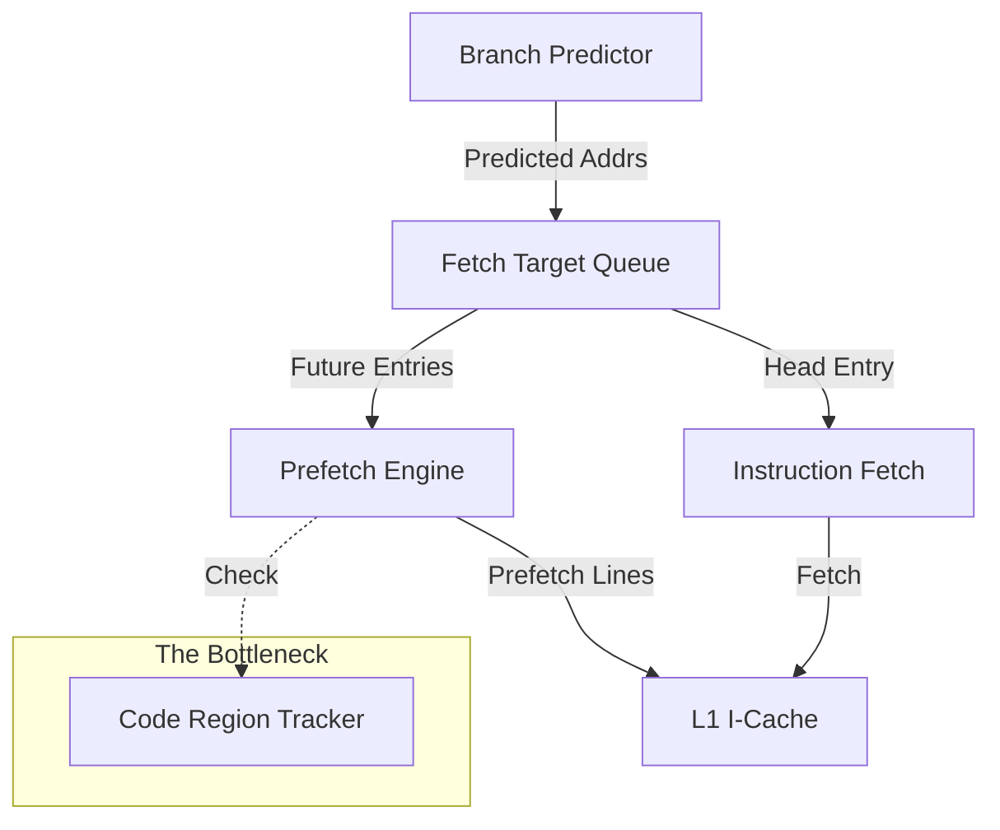

If you've been optimizing large workloads on ARM Neoverse servers (like NVIDIA Grace), you might have encountered a ghost. You scale your application up, performance scales linearly, and then suddenly—*boom*. You hit a cliff. Throughput drops by 30-50%. Perf profiles show a frontend stall massacre.

What just happened? You likely tripped over the **Code Region Tracker**.

In this post, I want to dive into a specific microarchitectural quirk of modern ARM cores that makes code locality significantly more critical than on x86, and why tools like BOLT are becoming mandatory for hyperscale ARM deployments.

## The 30-Region Limit

The rule of thumb for NVIDIA Grace (Neoverse V2) tuning is specific and slightly terrifying:

> "Applications accessing **>30 naturally aligned 2MB ranges** in quick succession can suffer up to **50% performance degradation**."

30 ranges of 2MB is 60MB of hot code. That sounds like a lot, but for a modern database (MySQL, Postgres), a JVM heap+code cache, or a monolithic microservice, it's a Tuesday.

When your instruction working set scatters across more than ~30 of these 2MB chunks, the CPU frontend chokes. To understand why, we need to look at how modern ARM cores fetch instructions.

## The Hardware: FDIP and the Region Tracker

Modern high-performance ARM cores (since Cortex-A76) use a **decoupled branch predictor**. The branch predictor runs ahead of the instruction fetch unit, filling a "Fetch Target Queue" (FTQ) with addresses it thinks the CPU will need next.

This enables a powerful feature called **Fetch-Directed Instruction Prefetching (FDIP)**. The prefetcher scans the FTQ and pulls lines into the L1 Instruction Cache (L1I) *before* the fetch unit even asks for them. It’s a beautiful system that hides memory latency.

But there's a catch. The prefetcher can't just prefetch from anywhere. It relies on a structure called the **Code Region Tracker** (or Region Table) to track which 2MB virtual address ranges currently contain active code.

This tracker has a finite number of slots. On Neoverse V2, it's improved over previous generations, but it's still finite (likely effectively around that 30-region mark).

**When the tracker overflows:**
1. The branch predictor loses its ability to direct prefetches into untracked regions.
2. The prefetch engine stalls or thrashes the tracker slots.
3. The L1I cache runs dry because lines aren't arriving in time.
4. The pipeline starves.

This isn't a gradual degradation; it's a cliff. Once you exceed the tracker's capacity, you fall off the optimal "streaming" path of the frontend.

## Why doesn't x86 care?

You generally don't see this specific cliff on Intel or AMD chips. Why?

1.  **Massive iTLBs**: An Intel Golden Cove core has 256 iTLB entries. ARM Neoverse cores typically have 48. That's a 5.3x difference. Intel can cover 512MB of code with 2MB pages without breaking a sweat; ARM starts thrashing at roughly 96MB.
2.  **The µOp Cache**: Modern x86 cores have enormous micro-op (decoded instruction) caches. Golden Cove has 4K entries; Lion Cove has over 5K. When you hit in the µOp cache, you bypass the L1I and iTLB entirely. You don't care where the code lives because you aren't fetching bytes; you're fetching decoded ops. ARM has a µOp cache too, but it's typically smaller (~1.5K entries), providing less "shielding" from L1I misses.

## The Solution: BOLT and Layout Optimization

Since we can't solder more iTLB entries onto the chip, we have to fix the software. The solution is **Binary Optimization and Layout Tools (BOLT)**.

BOLT takes a compiled binary and a `perf` profile of it running a real workload. It then rearranges the basic blocks and functions to pack the "hot" code tightly together.

If your application's hot code is scattered across 100MB, BOLT can often pack 99% of the execution time into just 4-8MB of dense instructions.

*   **Before BOLT**: Hot code spread across 50 regions. Tracker overflows. Frontend stalls.
*   **After BOLT**: Hot code packed into 3 regions. Tracker is happy. Prefetcher sings.

For the Linux kernel, we're seeing this too. Google and Meta have been pushing **AutoFDO** and **Propeller** (similar concepts) into the kernel. In recent benchmarks, simply reorganizing the kernel's binary layout yielded 2-5% system-level performance gains. On a hyperscale deployment, that's millions of dollars of free compute.

## Key Takeaways

1.  **Code layout is a first-class performance constraint** on ARM servers. You cannot ignore it for large binaries.
2.  **The "Cliff" is real**: Exceeding ~60MB (30 regions) of scattered hot code causes a sharp drop in IPC due to the Region Tracker and iTLB limits.
3.  **Profile-Guided Optimization is the fix**: Tools like BOLT and AutoFDO aren't just for squeezing out the last 1%; on ARM, they are structural fixes for frontend bottlenecks.

We are entering an era where the compiler's static guess at code layout isn't good enough. The hardware demands runtime awareness. If you're running heavy on ARM, it's time to get familiar with `perf record -e cs_etm`.
